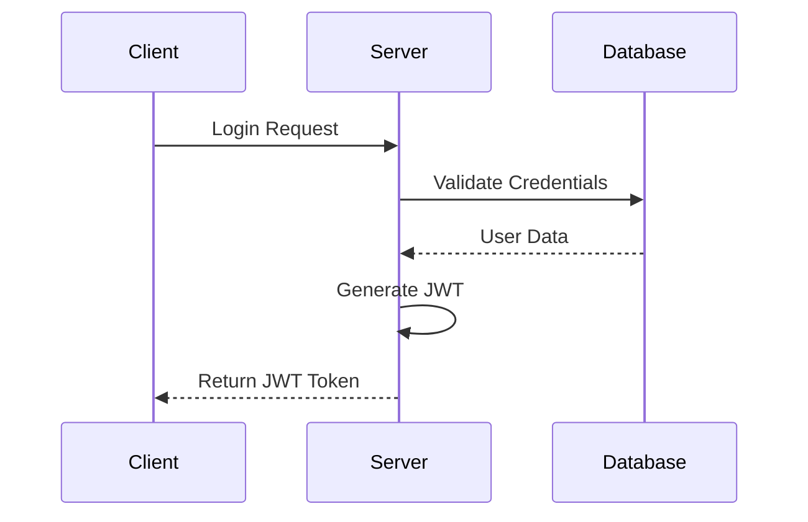

# Authentication

## Overview

PlanVenture uses JWT tokens for authentication. All authenticated endpoints require a valid JWT token in the Authorization header.

## Flow Diagram



## Endpoints

| Method | Endpoint | Description |
|--------|----------|-------------|
| POST | `/auth/login` | Authenticate user |
| POST | `/auth/register` | Create new account |
| POST | `/auth/refresh` | Refresh JWT token |

## Example Request

```typescript
const response = await fetch('/api/auth/login', {
  method: 'POST',
  headers: {
    'Content-Type': 'application/json'
  },
  body: JSON.stringify({
    email: 'user@example.com',
    password: 'password123'
  })
})
```
