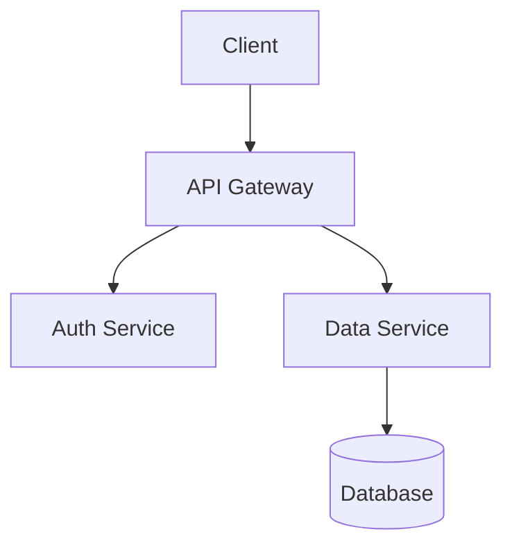

# System Architecture

## Overview

## Key Components

- **Frontend**: React + TypeScript
- **Backend**: Flask + SQLAlchemy
- **Database**: PostgreSQL
- **Authentication**: JWT + OAuth2

## Security Measures

1. JWT-based authentication
2. CORS protection
3. Password hashing with bcrypt
4. Rate limiting
